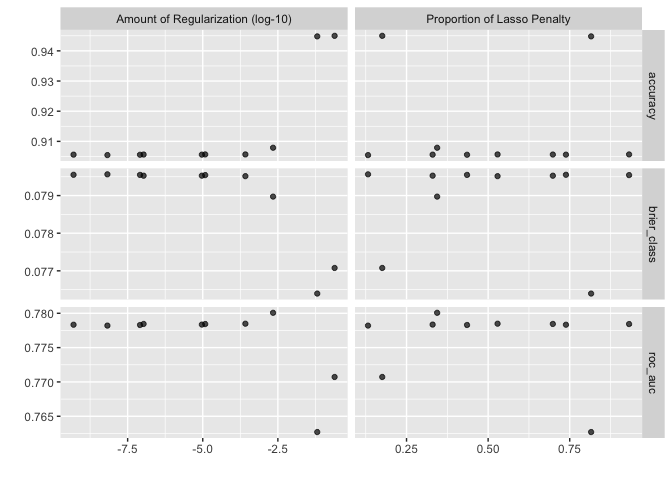

``` r
knitr::opts_chunk$set(echo = TRUE)
library(tidyverse)
library(tidymodels)
library(sjPlot)
library(finalfit)
library(knitr)
library(gtsummary)
library(mlbench)
library(rms)
library(vip)
library(rsample)
library(tune)
library(recipes)
library(yardstick)
library(parsnip)
library(glmnet)
library(themis)
```

# 1. Logistic Regression - The Machine Learning Way
 
Here we are going to compare and contrast logistic regression approaches from biostatistics and machine learning. Logistic regression is a very common approach used in epi and biostatistics so it's a good starting point to get us to understand machine learning. 

## Variable selection

**Biostats Approach:** A Biostatistics approach to selection variables would select one specific exposure (or predictor) of interest and that you want to examine related to some specific health outcome. Here are going to look at diabetes as the outcome and physical activity as a primary exposure of interest. Once you select exposure and outcome, you would typically decide on some covariates/confounders/effect modifiers. There are a number of ways to select those and we are not going to get into that today. If you were doing a more associational type study you might just a pick a bunch of variables to go into a model. 

**Machine learning Approach:** In general machine learning does really care about which variables go into your model, rather we care about how the model as a whole performs in training and testing. The overall goal is to build a model that predicts the outcome very well. Very well, is sort of defined by the field and we will get more into that later. 

## 2. Research question and data

We are using an imputed (ie. no missing data) version of the CanPath student dataset [https://canpath.ca/student-dataset/](https://canpath.ca/student-dataset/). The nice thing about this dataset is that it's pretty big in terms of sample size, has lots of variables, and we can use it for free. 

Our research question is:  

- **Can we develop a model that will predict type 2 diabetes**

We have identified that the following factors are associated with type 2 diabetes:   

- `PM_BMI_SR` = Are overweight
- `SDC_AGE_CALC` = Are 45 years or older
- `No varaible in data` = Have a parent, brother, or sister with type 2 diabetes
- `PA_LEVEL_LONG` = Are physically active less than 3 times a week
- `diabetes == "Gestational"` = Have ever had gestational diabetes (diabetes during pregnancy) or given birth to a baby who weighed over 9 pounds
- `SDC_EB_ABORIGINAL` + `SDC_EB_LATIN` + `SDC_EB_BLACK` = Are an African American, Hispanic or Latino, American Indian, or Alaska Native person
- `DIS_LIVER_FATTY_EVER` = Have non-alcoholic fatty liver disease

### Reading in data

Here are reading in data and getting organized to run our models. 


``` r
data <- read_csv("data_imputed.csv")
```

```
## Rows: 39392 Columns: 29
## ── Column specification ────────────────────────────────────────────────────────
## Delimiter: ","
## chr  (6): diabetes, pa_cat, latinx, indigenous, eb_black, fatty_liver
## dbl (23): diabetes_t2, PM_BMI_SR, SDC_AGE_CALC, SDC_MARITAL_STATUS, SDC_EDU_...
## 
## ℹ Use `spec()` to retrieve the full column specification for this data.
## ℹ Specify the column types or set `show_col_types = FALSE` to quiet this message.
```

``` r
data$diabetes <- NULL

cols <- c("pa_cat", "latinx", "indigenous", "eb_black", "fatty_liver", "SDC_MARITAL_STATUS", "SDC_EDU_LEVEL", "SDC_INCOME", "HS_GEN_HEALTH",  "SDC_BIRTH_COUNTRY", "SMK_CIG_STATUS", "DIS_DIAB_FAM_EVER", "DIS_DIAB_FAM_EVER", "HS_ROUTINE_VISIT_EVER", "DIS_STROKE_EVER", "DIS_COPD_EVER", "DIS_LC_EVER", "DIS_IBS_EVER", "DIS_DIAB_FAM_EVER", "WRK_FULL_TIME", "WRK_STUDENT", "PM_BMI_SR", "PM_WEIGHT_SR_AVG")
data %<>% mutate_at(cols, factor)

data$diabetes_t2 <- as.factor(data$diabetes_t2)
data$PM_BMI_SR <- as.numeric(data$PM_BMI_SR)
data$PM_WEIGHT_SR_AVG <- as.numeric(data$PM_WEIGHT_SR_AVG)
```

## 2. Biostatistics Approach 

Using a more biostatistics approach to our analysis we would take all of the data and run the regression and get the results. We would make sure to check that the distribution of the outcome variable is rare as this is a cross-section study and we want our OR to approximate an RR. Then we would run the regression with all of the data.


``` r
table(data$diabetes_t2)
```

```
## 
##     0     1 
## 37207  2185
```

``` r
biostats_logistic <- glm(diabetes_t2 ~ PM_BMI_SR + SDC_AGE_CALC + pa_cat + latinx + indigenous + eb_black + fatty_liver + SDC_MARITAL_STATUS + SDC_EDU_LEVEL + SDC_INCOME + HS_GEN_HEALTH + NUT_VEG_QTY + NUT_FRUITS_QTY + ALC_CUR_FREQ + SDC_BIRTH_COUNTRY + PA_SIT_AVG_TIME_DAY + SMK_CIG_STATUS + SLE_TIME + DIS_DIAB_FAM_EVER, data = data, family = "binomial")
summary(biostats_logistic)
```

```
## 
## Call:
## glm(formula = diabetes_t2 ~ PM_BMI_SR + SDC_AGE_CALC + pa_cat + 
##     latinx + indigenous + eb_black + fatty_liver + SDC_MARITAL_STATUS + 
##     SDC_EDU_LEVEL + SDC_INCOME + HS_GEN_HEALTH + NUT_VEG_QTY + 
##     NUT_FRUITS_QTY + ALC_CUR_FREQ + SDC_BIRTH_COUNTRY + PA_SIT_AVG_TIME_DAY + 
##     SMK_CIG_STATUS + SLE_TIME + DIS_DIAB_FAM_EVER, family = "binomial", 
##     data = data)
## 
## Coefficients:
##                             Estimate Std. Error z value Pr(>|z|)    
## (Intercept)               -5.511e+00  4.995e-01 -11.031  < 2e-16 ***
## PM_BMI_SR                  1.320e-04  1.117e-05  11.816  < 2e-16 ***
## SDC_AGE_CALC               5.400e-02  2.542e-03  21.239  < 2e-16 ***
## pa_cat2_Moderate Activity  1.718e-02  5.735e-02   0.300 0.764431    
## pa_cat3_High Activity     -6.827e-03  5.811e-02  -0.117 0.906475    
## latinxYes                 -2.073e-01  2.291e-01  -0.905 0.365661    
## indigenousYes              5.086e-02  1.128e-01   0.451 0.652087    
## eb_blackYes                2.677e-01  1.812e-01   1.478 0.139462    
## fatty_liverYes             4.498e-01  2.229e-01   2.018 0.043597 *  
## SDC_MARITAL_STATUS2       -2.535e-02  8.007e-02  -0.317 0.751573    
## SDC_MARITAL_STATUS3       -6.138e-02  1.149e-01  -0.534 0.593175    
## SDC_MARITAL_STATUS4        6.832e-02  1.198e-01   0.570 0.568562    
## SDC_MARITAL_STATUS5        1.666e-01  8.396e-02   1.984 0.047221 *  
## SDC_EDU_LEVEL1            -1.302e-01  4.421e-01  -0.295 0.768367    
## SDC_EDU_LEVEL2            -2.754e-01  4.208e-01  -0.654 0.512865    
## SDC_EDU_LEVEL3            -1.588e-01  4.241e-01  -0.374 0.708091    
## SDC_EDU_LEVEL4            -3.254e-01  4.211e-01  -0.773 0.439735    
## SDC_EDU_LEVEL5            -2.164e-01  4.319e-01  -0.501 0.616318    
## SDC_EDU_LEVEL6            -2.074e-01  4.219e-01  -0.492 0.623060    
## SDC_EDU_LEVEL7            -1.194e-01  4.240e-01  -0.281 0.778350    
## SDC_INCOME2                1.195e-02  1.764e-01   0.068 0.946005    
## SDC_INCOME3               -9.824e-02  1.673e-01  -0.587 0.557109    
## SDC_INCOME4               -6.786e-02  1.685e-01  -0.403 0.687167    
## SDC_INCOME5               -1.184e-01  1.716e-01  -0.690 0.490309    
## SDC_INCOME6               -6.173e-02  1.726e-01  -0.358 0.720550    
## SDC_INCOME7                1.504e-02  1.853e-01   0.081 0.935329    
## SDC_INCOME8               -2.442e-01  2.001e-01  -1.220 0.222418    
## HS_GEN_HEALTH2             4.723e-02  1.132e-01   0.417 0.676454    
## HS_GEN_HEALTH3            -7.645e-01  1.087e-01  -7.036 1.98e-12 ***
## HS_GEN_HEALTH4            -1.571e+00  1.148e-01 -13.682  < 2e-16 ***
## HS_GEN_HEALTH5            -1.903e+00  1.391e-01 -13.678  < 2e-16 ***
## NUT_VEG_QTY               -1.397e-02  1.571e-02  -0.890 0.373681    
## NUT_FRUITS_QTY             6.590e-02  1.730e-02   3.810 0.000139 ***
## ALC_CUR_FREQ              -7.528e-02  1.071e-02  -7.029 2.08e-12 ***
## SDC_BIRTH_COUNTRY2         2.123e-01  1.849e-01   1.148 0.250949    
## SDC_BIRTH_COUNTRY3        -5.413e-01  7.295e-01  -0.742 0.458075    
## SDC_BIRTH_COUNTRY4         2.490e-01  2.163e-01   1.151 0.249720    
## SDC_BIRTH_COUNTRY5        -1.861e-01  6.149e-01  -0.303 0.762175    
## SDC_BIRTH_COUNTRY6         1.961e-01  2.057e-01   0.953 0.340360    
## SDC_BIRTH_COUNTRY7         3.710e-01  5.381e-01   0.689 0.490512    
## SDC_BIRTH_COUNTRY8        -9.116e-02  4.011e-01  -0.227 0.820222    
## SDC_BIRTH_COUNTRY9         5.367e-01  2.629e-01   2.042 0.041171 *  
## SDC_BIRTH_COUNTRY10        2.193e-01  4.081e-01   0.537 0.591035    
## SDC_BIRTH_COUNTRY11       -5.228e-01  1.056e+00  -0.495 0.620459    
## SDC_BIRTH_COUNTRY12        7.988e-01  2.593e-01   3.080 0.002070 ** 
## SDC_BIRTH_COUNTRY13       -6.444e-01  4.267e-01  -1.510 0.130996    
## SDC_BIRTH_COUNTRY14       -7.357e-01  7.289e-01  -1.009 0.312810    
## SDC_BIRTH_COUNTRY15       -6.988e-01  7.256e-01  -0.963 0.335510    
## SDC_BIRTH_COUNTRY16       -4.720e-01  7.364e-01  -0.641 0.521567    
## SDC_BIRTH_COUNTRY17        8.222e-02  1.018e-01   0.808 0.419154    
## SDC_BIRTH_COUNTRY18       -1.283e-01  1.672e-01  -0.767 0.443088    
## SDC_BIRTH_COUNTRY19        2.135e-01  6.272e-01   0.340 0.733604    
## SDC_BIRTH_COUNTRY20       -5.804e-02  9.277e-02  -0.626 0.531536    
## PA_SIT_AVG_TIME_DAY        4.114e-05  5.284e-05   0.779 0.436258    
## SMK_CIG_STATUS1            3.899e-02  5.121e-02   0.761 0.446447    
## SMK_CIG_STATUS2           -1.639e-01  1.635e-01  -1.002 0.316337    
## SMK_CIG_STATUS3            2.831e-01  7.562e-02   3.743 0.000182 ***
## SLE_TIME                   7.123e-04  2.837e-04   2.511 0.012049 *  
## DIS_DIAB_FAM_EVER1         6.366e-01  5.378e-02  11.837  < 2e-16 ***
## DIS_DIAB_FAM_EVER2        -1.689e-01  7.101e-02  -2.379 0.017365 *  
## ---
## Signif. codes:  0 '***' 0.001 '**' 0.01 '*' 0.05 '.' 0.1 ' ' 1
## 
## (Dispersion parameter for binomial family taken to be 1)
## 
##     Null deviance: 16884  on 39391  degrees of freedom
## Residual deviance: 14585  on 39332  degrees of freedom
## AIC: 14705
## 
## Number of Fisher Scoring iterations: 6
```

``` r
multi_table <- tbl_regression(biostats_logistic, exponentiate = TRUE) 
multi_table %>% as_kable()
```


|**Characteristic**  | **OR** | **95% CI** | **p-value** |
|:-------------------|:------:|:----------:|:-----------:|
|PM_BMI_SR           |  1.00  | 1.00, 1.00 |   <0.001    |
|SDC_AGE_CALC        |  1.06  | 1.05, 1.06 |   <0.001    |
|pa_cat              |        |            |             |
|1_Low Activity      |   —    |     —      |             |
|2_Moderate Activity |  1.02  | 0.91, 1.14 |     0.8     |
|3_High Activity     |  0.99  | 0.89, 1.11 |    >0.9     |
|latinx              |        |            |             |
|No                  |   —    |     —      |             |
|Yes                 |  0.81  | 0.50, 1.24 |     0.4     |
|indigenous          |        |            |             |
|No                  |   —    |     —      |             |
|Yes                 |  1.05  | 0.84, 1.31 |     0.7     |
|eb_black            |        |            |             |
|No                  |   —    |     —      |             |
|Yes                 |  1.31  | 0.90, 1.84 |    0.14     |
|fatty_liver         |        |            |             |
|No                  |   —    |     —      |             |
|Yes                 |  1.57  | 0.99, 2.38 |    0.044    |
|SDC_MARITAL_STATUS  |        |            |             |
|1                   |   —    |     —      |             |
|2                   |  0.97  | 0.83, 1.14 |     0.8     |
|3                   |  0.94  | 0.75, 1.17 |     0.6     |
|4                   |  1.07  | 0.84, 1.35 |     0.6     |
|5                   |  1.18  | 1.00, 1.39 |    0.047    |
|SDC_EDU_LEVEL       |        |            |             |
|0                   |   —    |     —      |             |
|1                   |  0.88  | 0.39, 2.26 |     0.8     |
|2                   |  0.76  | 0.35, 1.89 |     0.5     |
|3                   |  0.85  | 0.40, 2.13 |     0.7     |
|4                   |  0.72  | 0.34, 1.80 |     0.4     |
|5                   |  0.81  | 0.37, 2.04 |     0.6     |
|6                   |  0.81  | 0.38, 2.03 |     0.6     |
|7                   |  0.89  | 0.41, 2.22 |     0.8     |
|SDC_INCOME          |        |            |             |
|1                   |   —    |     —      |             |
|2                   |  1.01  | 0.72, 1.44 |    >0.9     |
|3                   |  0.91  | 0.66, 1.27 |     0.6     |
|4                   |  0.93  | 0.68, 1.31 |     0.7     |
|5                   |  0.89  | 0.64, 1.26 |     0.5     |
|6                   |  0.94  | 0.68, 1.33 |     0.7     |
|7                   |  1.02  | 0.71, 1.47 |    >0.9     |
|8                   |  0.78  | 0.53, 1.17 |     0.2     |
|HS_GEN_HEALTH       |        |            |             |
|1                   |   —    |     —      |             |
|2                   |  1.05  | 0.84, 1.31 |     0.7     |
|3                   |  0.47  | 0.38, 0.58 |   <0.001    |
|4                   |  0.21  | 0.17, 0.26 |   <0.001    |
|5                   |  0.15  | 0.11, 0.20 |   <0.001    |
|NUT_VEG_QTY         |  0.99  | 0.96, 1.02 |     0.4     |
|NUT_FRUITS_QTY      |  1.07  | 1.03, 1.10 |   <0.001    |
|ALC_CUR_FREQ        |  0.93  | 0.91, 0.95 |   <0.001    |
|SDC_BIRTH_COUNTRY   |        |            |             |
|1                   |   —    |     —      |             |
|2                   |  1.24  | 0.85, 1.75 |     0.3     |
|3                   |  0.58  | 0.09, 1.92 |     0.5     |
|4                   |  1.28  | 0.82, 1.92 |     0.2     |
|5                   |  0.83  | 0.20, 2.38 |     0.8     |
|6                   |  1.22  | 0.80, 1.79 |     0.3     |
|7                   |  1.45  | 0.43, 3.71 |     0.5     |
|8                   |  0.91  | 0.38, 1.87 |     0.8     |
|9                   |  1.71  | 0.99, 2.79 |    0.041    |
|10                  |  1.25  | 0.52, 2.62 |     0.6     |
|11                  |  0.59  | 0.03, 3.03 |     0.6     |
|12                  |  2.22  | 1.30, 3.60 |    0.002    |
|13                  |  0.52  | 0.20, 1.11 |    0.13     |
|14                  |  0.48  | 0.08, 1.57 |     0.3     |
|15                  |  0.50  | 0.08, 1.62 |     0.3     |
|16                  |  0.62  | 0.10, 2.09 |     0.5     |
|17                  |  1.09  | 0.89, 1.32 |     0.4     |
|18                  |  0.88  | 0.63, 1.21 |     0.4     |
|19                  |  1.24  | 0.29, 3.62 |     0.7     |
|20                  |  0.94  | 0.78, 1.13 |     0.5     |
|PA_SIT_AVG_TIME_DAY |  1.00  | 1.00, 1.00 |     0.4     |
|SMK_CIG_STATUS      |        |            |             |
|0                   |   —    |     —      |             |
|1                   |  1.04  | 0.94, 1.15 |     0.4     |
|2                   |  0.85  | 0.61, 1.16 |     0.3     |
|3                   |  1.33  | 1.14, 1.54 |   <0.001    |
|SLE_TIME            |  1.00  | 1.00, 1.00 |    0.012    |
|DIS_DIAB_FAM_EVER   |        |            |             |
|0                   |   —    |     —      |             |
|1                   |  1.89  | 1.70, 2.10 |   <0.001    |
|2                   |  0.84  | 0.73, 0.97 |    0.017    |

We would then use the ORs, CIs, and p-values to get information about the strength, direction, and probability that the association is due to chance or not (Not getting the p-value debate here). 

## 3. Machine Learning - Logistic Regression 

In a machine learning approach, in general, our interest is less on the specific associations we see between individual variables and the outcome and more on the overall performance of the model in terms of predicting the outcome. You might remember this like AIC, BIC, or -2Log-Likelihood, or Pseudo-R2 for model fit in logistic regression. 

In ML, another key concept is model performance on unseen data. With the biostatistics approach, we want to know if the model fits some known distriution (think linear regression) but with ML we don't really care about that, we care about model performance with unseen data. Hopefully, that will sense later. 

### 3.1 Resampling (Part 1)

More machine learning we need a way to split the data into a training set and a test set. There are a few different approaches too this. Here we are going to use an 70/30 split with 70% of the data going to training and 30 going to testing. This is sort of an older way to split data and I would say that a k-fold cross validation is probably more in line with modern practice. We will test this out later.  


``` r
# Fix the random numbers by setting the seed 
# This enables the analysis to be reproducible when random numbers are used 
set.seed(10)

data_split <- initial_split(data, prop = 0.70, strata = diabetes_t2)

# Create data frames for the two sets:
train_data <- training(data_split)
table(train_data$diabetes_t2)
```

```
## 
##     0     1 
## 26057  1517
```

``` r
test_data  <- testing(data_split)
table(test_data$diabetes_t2)
```

```
## 
##     0     1 
## 11150   668
```

Now we have split the data, we want to create the model for the training data and save it so it can be applied to the testing set. This is basically exactly what we did before. __Note that we only run the model on the training data__ Not all of the data like would in a traditional logistic regression. Here we won't get the exact same result as our original logistic regression because we don't have the same data. We expect there will be some variation but that the results should relatively similar. 

**Another note. I've added variables to this model compared to our previous model. The previous model did a very poor job of predicting diabetes overall. In fact, it had a sensitivity of ZERO! Meaning it did not predict a single case of diabetes in the test set. That's bad so I've added variables to try and increase our prediction ability. This is a key difference in typical etiologic epidemiology versus machine learning focused analyses. 

### 3.2 Running the regression


``` r
logistic_model <- logistic_reg() %>%
        set_engine("glm") %>%
        set_mode("classification") %>%
        fit(diabetes_t2 ~ PM_BMI_SR + SDC_AGE_CALC + pa_cat + latinx + indigenous + eb_black + fatty_liver + SDC_MARITAL_STATUS + SDC_EDU_LEVEL + SDC_INCOME + HS_GEN_HEALTH + NUT_VEG_QTY + NUT_FRUITS_QTY + ALC_CUR_FREQ + SDC_BIRTH_COUNTRY + PA_SIT_AVG_TIME_DAY + SMK_CIG_STATUS + SLE_TIME + DIS_DIAB_FAM_EVER + HS_ROUTINE_VISIT_EVER + DIS_STROKE_EVER + DIS_COPD_EVER + DIS_LC_EVER + DIS_IBS_EVER + DIS_DIAB_FAM_EVER + WRK_FULL_TIME + WRK_STUDENT + PM_WEIGHT_SR_AVG, data = train_data)
```

### 3.3 Test the trained model

Once we `train the model` we want to understand how well our trained model works on new data the model has not seen. This is where the testing data comes in. We can use the `predict` feature for this. What we are doing here is predicting if someone has diabetes (yes/no) from the model we trained using the training data, on the testing data. We had 4293 observations in the training with 4077 people with on diabetes and 216 people with diabetes. Much of this example comes from [https://medium.com/the-researchers-guide/modelling-binary-logistic-regression-using-tidymodels-library-in-r-part-1-c1bdce0ac055](https://medium.com/the-researchers-guide/modelling-binary-logistic-regression-using-tidymodels-library-in-r-part-1-c1bdce0ac055)

The code below outputs the predict class `diabetes (yes/no)` for the test data. 


``` r
pred_class <- predict(logistic_model,
                      new_data = test_data,
                      type = "class")
table(pred_class$.pred_class)
```

```
## 
##     0     1 
## 11803    15
```

``` r
table(train_data$diabetes_t2)
```

```
## 
##     0     1 
## 26057  1517
```

Our model predicts that we have 4206 people with diabetes and 4 people with diabetes. Not looking good for our model! 

Now we want to generated the predicted probabilities for the model. That is, how well does our model think it does for each person. 


``` r
pred_prob <- predict(logistic_model,
                      new_data = test_data,
                      type = "prob")
head(pred_prob)
```

```
## # A tibble: 6 × 2
##   .pred_0 .pred_1
##     <dbl>   <dbl>
## 1   0.990 0.00991
## 2   0.955 0.0451 
## 3   0.961 0.0393 
## 4   0.978 0.0220 
## 5   0.942 0.0580 
## 6   0.985 0.0151
```

This is not very informative in terms of results but we will discuss this more later. 

Now we want to combine all of our results into one dataframe and just do a quick check. 


``` r
diabetes_results <- test_data %>%
  select(diabetes_t2) %>%
  bind_cols(pred_class, pred_prob)

head(diabetes_results)
```

```
## # A tibble: 6 × 4
##   diabetes_t2 .pred_class .pred_0 .pred_1
##   <fct>       <fct>         <dbl>   <dbl>
## 1 0           0             0.990 0.00991
## 2 0           0             0.955 0.0451 
## 3 0           0             0.961 0.0393 
## 4 0           0             0.978 0.0220 
## 5 1           0             0.942 0.0580 
## 6 0           0             0.985 0.0151
```

Here we can see the first 6 rows of data data all negative for diabetes and are predicted as negative. The model is very confident in these predictions, with over 90% negative prediction in all six observations. 

### 3.3 Model evaluation

There are a number of different methods we must use to evaluate machine learning models. We will walk through those. 

#### Confusion Matrix

We can generate a confusion matrix by using the `conf_mat()` function by supplying the final data frame (`diabetes_results`), the truth column `diabetes_t2` and predicted class `.pred_class` in the estimate attribute.

A confusion matrix is sort of a 2x2 table with the true values on one side and predicted values in another column. If we look on the diagonal we see when the model correctly predicts the values `yes/no` and off diagonal is when the model does not predict the correct value. So this model correctly predicts that 4075 cases of diabetes and incorrectly predicts that 212 people do not have diabetes when they do have it. The model correctly predicts 4 cases of diabetes. It also incorrectly predicts that two people who do not have diabetes do have diabetes. 


``` r
conf_mat(diabetes_results, truth = diabetes_t2,
         estimate = .pred_class)
```

```
##           Truth
## Prediction     0     1
##          0 11138   665
##          1    12     3
```

#### Accuracy

We can calculate the classification accuracy by using the `accuracy()` function by supplying the final data frame `diabetes_results`, the truth column `diabetes_t2` and predicted class `.pred_class` in the estimate attribute. The model classification accuracy on test dataset is about ~94%. This looks good but it's a bit of fake result as we will see later. 


``` r
accuracy(diabetes_results, truth = diabetes_t2,
         estimate = .pred_class)
```

```
## # A tibble: 1 × 3
##   .metric  .estimator .estimate
##   <chr>    <chr>          <dbl>
## 1 accuracy binary         0.943
```

#### Sensitivity

The sensitivity (also known as __Recall__) of a classifier is the ratio between what was correctly identified as positive (True Positives) and all positives (False Negative + True Positive).

__Sensitivity = TP / FN + TP__

The sensitivity value is 1.0 indicating that we are able to correctly detect 100% of the positive values.  


``` r
sens(diabetes_results, truth = diabetes_t2,
    estimate = .pred_class)
```

```
## # A tibble: 1 × 3
##   .metric .estimator .estimate
##   <chr>   <chr>          <dbl>
## 1 sens    binary         0.999
```

#### Specificity

Specificity of a classifier is the ratio between what was classified as negative (True Negatives) and all negative values (False Positive + True Native)

__Specificity = TN / FP + TN__

The specificity value is 0.004. Meaning that we correctly classify 0.4% of the negative values, which is pretty terrible. 


``` r
spec(diabetes_results, truth = diabetes_t2,
    estimate = .pred_class)
```

```
## # A tibble: 1 × 3
##   .metric .estimator .estimate
##   <chr>   <chr>          <dbl>
## 1 spec    binary       0.00449
```

#### Precision

What percent of values are correctly classified as positive (True Positives) out of all positives (True Positive + False Positive)?

__Precision = TP / TP + FP__

The precision is 0.94, meaning we identify 81.8% of true positives compared to all positives. 


``` r
precision(diabetes_results, truth = diabetes_t2,
    estimate = .pred_class)
```

```
## # A tibble: 1 × 3
##   .metric   .estimator .estimate
##   <chr>     <chr>          <dbl>
## 1 precision binary         0.944
```

#### F-Score

F-score is the mean of precision and sensitivity. The value ranges from 1 (the best score) and 0 (the worst score). F-score gives us the balance between precision and sensitivity. The F1 score is about 0.97, which indicates that the trained model has a classification strength of 97%.


``` r
f_meas(diabetes_results, truth = diabetes_t2,
       estimate = .pred_class)
```

```
## # A tibble: 1 × 3
##   .metric .estimator .estimate
##   <chr>   <chr>          <dbl>
## 1 f_meas  binary         0.971
```

#### ROC Curve

The ROC curve is plotted with `sensitivity` against `1 - Specificity`, where `sensitivity` is on the y-axis and `1 - Specificity` is on the x-axis. A line is drawn diagonally to denote 50–50 partitioning of the graph. If the curve is more close to the line, lower the performance of the classifier, which is no better than a mere random guess.

You can generate a ROC Curve using the `roc_curve()` function where you need to supply the truth column `diabetes_t2` and predicted probabilities for the positive class `.pred_pos`.

Our model has got a ROC-AUC score of 0.227 indicating a good model that cannot distinguish between patients with diabetes and no diabetes.


``` r
roc_auc(diabetes_results,
        truth = diabetes_t2,
        .pred_1)
```

```
## # A tibble: 1 × 3
##   .metric .estimator .estimate
##   <chr>   <chr>          <dbl>
## 1 roc_auc binary         0.226
```

``` r
roc_curve <- diabetes_results %>%
  roc_curve(truth = diabetes_t2, .pred_1) %>%
  autoplot()

plot(roc_curve)
```

<!-- -->

#### All the metrics 

We can produce all of the metrics using the `metric_set` function. 


``` r
metrics <- metric_set(accuracy, sens, spec, precision, recall, f_meas)

all_metrics_lr <- metrics(diabetes_results,
               truth = diabetes_t2,
               estimate = .pred_class)
               
kable(all_metrics_lr)
```


|.metric   |.estimator | .estimate|
|:---------|:----------|---------:|
|accuracy  |binary     | 0.9427145|
|sens      |binary     | 0.9989238|
|spec      |binary     | 0.0044910|
|precision |binary     | 0.9436584|
|recall    |binary     | 0.9989238|
|f_meas    |binary     | 0.9705049|

#### Feature Importance

Feature importance is the one way that ML models examine which variables are important to the predictions overall. It's not super common to see, except for people like Epi folks who think about specific associations between variables. 


``` r
coeff <- tidy(logistic_model) %>% 
  arrange(desc(abs(estimate))) %>% 
  filter(abs(estimate) > 0.5)

kable(coeff)
```


|term                |   estimate| std.error|   statistic|   p.value|
|:-------------------|----------:|---------:|-----------:|---------:|
|(Intercept)         | -5.3454674| 0.6036008|  -8.8559655| 0.0000000|
|HS_GEN_HEALTH5      | -1.7506584| 0.1701633| -10.2881063| 0.0000000|
|HS_GEN_HEALTH4      | -1.5259417| 0.1434398| -10.6382055| 0.0000000|
|SDC_BIRTH_COUNTRY12 |  1.1298632| 0.2819733|   4.0069868| 0.0000615|
|SDC_BIRTH_COUNTRY14 | -1.0191515| 1.0205845|  -0.9985959| 0.3179905|
|DIS_LC_EVER1        |  0.8362270| 0.2800270|   2.9862370| 0.0028243|
|SDC_BIRTH_COUNTRY3  | -0.8100273| 1.0250462|  -0.7902349| 0.4293906|
|DIS_DIAB_FAM_EVER1  |  0.7264587| 0.0655075|  11.0897011| 0.0000000|
|SDC_BIRTH_COUNTRY10 |  0.7210680| 0.4533465|   1.5905450| 0.1117120|
|SDC_EDU_LEVEL2      | -0.7126445| 0.4471268|  -1.5938307| 0.1109740|
|SDC_EDU_LEVEL4      | -0.6777405| 0.4473119|  -1.5151409| 0.1297367|
|HS_GEN_HEALTH3      | -0.6688773| 0.1348731|  -4.9593072| 0.0000007|
|SDC_EDU_LEVEL5      | -0.5837132| 0.4625524|  -1.2619394| 0.2069706|
|SDC_EDU_LEVEL3      | -0.5716542| 0.4514083|  -1.2663792| 0.2053773|
|SDC_EDU_LEVEL6      | -0.5681743| 0.4482513|  -1.2675350| 0.2049640|
|SDC_BIRTH_COUNTRY13 | -0.5629703| 0.5217877|  -1.0789261| 0.2806207|
|SDC_BIRTH_COUNTRY2  |  0.5007490| 0.2106120|   2.3775904| 0.0174262|

#### Plot of feature importance


``` r
ggplot(coeff, aes(x = term, y = estimate, fill = term)) + geom_col() + coord_flip()
```

<!-- -->

#### 3.4 Model interpretation

So now we have to interpret the model. General guidelines to think about the bias variance trade off and weather our model performs well. Based on the evaluation metrics how do we fell about this model? 

Typically in ML types of problems a model with less than 80-90% accuracy is consider ok, but it depends a bit on the problem. Our model has an accuracy of 95%... maybe that's good. HOWEVER, when we look at the sensitivity it's 1 and the specificity is 0.4%. A sensitivity of 1 (perfect) is suspect and our specificity is very very bad.

Overall, this model is not very good. We don't have a sufficient number of features (variables) to do a good job with prediction. We have a high bias, our model underfits the data. The variance is also high. 

### 3.5. Up-Sampling

OK. So our model is terrible. There are a number of reasons for this that we are going to explore now. These are standard machine learning explorations that we would normally do as part of machine learning analysis workflow. First, we are going to explore up-sampling. One of the main problems with the diabetes data we have is the prevalence of diabetes is relatively low in the dataset. This is good normally in biostatistics approaches as we want the OR to approximate the RR in a case control study. BUT that's terrible for prediction. 

One thing that we can do is up-scale the lowest class (or classes) or the outcome variable. There are a bunch of different methods to do this and we are using the `themis` package [https://themis.tidymodels.org/reference/index.html](https://themis.tidymodels.org/reference/index.html). Here we are using the `step_upsample()` function. We only want to use the up scaling methods on the training set. We don't use it on the test set because that would create a false model performance. 

#### Up-scaling Example


``` r
table(train_data$diabetes_t2)
```

```
## 
##     0     1 
## 26057  1517
```

``` r
ggplot(train_data) + 
    geom_bar(aes(diabetes_t2))
```

<!-- -->

``` r
diabetes_rec_oversamp <- 
  recipe(diabetes_t2 ~ ., data = train_data) %>%
  step_upsample(diabetes_t2, over_ratio = 0.3) %>%
  step_unknown() %>%
  step_dummy(all_nominal_predictors()) 

recipe(~., train_data) %>%
  step_upsample(diabetes_t2, over_ratio = 0.3) %>%
  prep() %>%
  bake(new_data = NULL) %>%
  ggplot(aes(diabetes_t2)) +
  geom_bar()
```

<!-- -->

Here we upscale the `diabetes-Yes` category to 30% of the of the `diabetes-No` category. The figures show the differences but we go from 1514 cases of diabetes in the training set to over 7000 cases of diabetes. 

**Up-scaling regression**

Setup the recipe and metrics 


``` r
logistic_m <- logistic_reg(
                mode = "classification",
                engine = "glm"
              )
```

Logistic regression results based on up-scaling 


``` r
diabetes_wflow_oversamp <- 
  workflow() %>% 
  add_model(logistic_m) %>% 
  add_recipe(diabetes_rec_oversamp)

diabetes_wflow_oversamp
```

```
## ══ Workflow ════════════════════════════════════════════════════════════════════
## Preprocessor: Recipe
## Model: logistic_reg()
## 
## ── Preprocessor ────────────────────────────────────────────────────────────────
## 3 Recipe Steps
## 
## • step_upsample()
## • step_unknown()
## • step_dummy()
## 
## ── Model ───────────────────────────────────────────────────────────────────────
## Logistic Regression Model Specification (classification)
## 
## Computational engine: glm
```

``` r
diabetes_fit_oversamp <- 
  diabetes_wflow_oversamp %>% 
  fit(data = train_data)

diabetes_fit_oversamp %>% 
  extract_fit_parsnip() %>% 
  tidy()
```

```
## # A tibble: 72 × 5
##    term                          estimate  std.error statistic   p.value
##    <chr>                            <dbl>      <dbl>     <dbl>     <dbl>
##  1 (Intercept)                 -4.04      0.338        -12.0   5.68e- 33
##  2 PM_BMI_SR                    0.0000610 0.00000900     6.77  1.27e- 11
##  3 SDC_AGE_CALC                 0.0591    0.00174       34.1   3.93e-254
##  4 NUT_VEG_QTY                 -0.00464   0.00931       -0.499 6.18e-  1
##  5 NUT_FRUITS_QTY               0.0631    0.0116         5.43  5.74e-  8
##  6 ALC_CUR_FREQ                -0.0784    0.00680      -11.5   9.57e- 31
##  7 PA_SIT_AVG_TIME_DAY          0.0000143 0.0000336      0.426 6.70e-  1
##  8 SLE_TIME                     0.000793  0.000181       4.38  1.21e-  5
##  9 PM_WEIGHT_SR_AVG             0.000339  0.0000355      9.55  1.36e- 21
## 10 pa_cat_X2_Moderate.Activity -0.0319    0.0368        -0.867 3.86e-  1
## # ℹ 62 more rows
```

``` r
diabetes_aug_oversamp <- 
  augment(diabetes_fit_oversamp, test_data)

diabetes_fit_oversamp_all_metrics <- metrics(diabetes_aug_oversamp,
               truth = diabetes_t2,
               estimate = .pred_class)
               
kable(diabetes_fit_oversamp_all_metrics)
```


|.metric   |.estimator | .estimate|
|:---------|:----------|---------:|
|accuracy  |binary     | 0.9053985|
|sens      |binary     | 0.9431390|
|spec      |binary     | 0.2754491|
|precision |binary     | 0.9560000|
|recall    |binary     | 0.9431390|
|f_meas    |binary     | 0.9495260|

Here we have dramatically improved our specificity from 0.004 to 0.28. Overall, our accuracy and other metrics have gone down... which is good. This model is much better and less suspect than our previous model. Our up-sampling has done well here. We could test more up-sampling but you get the idea here. 


``` r
kable(all_metrics_lr)
```


|.metric   |.estimator | .estimate|
|:---------|:----------|---------:|
|accuracy  |binary     | 0.9427145|
|sens      |binary     | 0.9989238|
|spec      |binary     | 0.0044910|
|precision |binary     | 0.9436584|
|recall    |binary     | 0.9989238|
|f_meas    |binary     | 0.9705049|

### 3.6. Resampling (part 2)

So we know that the up-scaling worked well to improve the model. Another thing we always want to test with an ML model is using a different type of resampling (validation) approach. Originally, we used a 70/30 split in the data, which is not the optimal approach. A better general approach is k-fold cross validation. This approach is very common. There is some discussion of a bunch of other approaches here [https://www.stepbystepdatascience.com/ml-with-tidymodels](https://www.stepbystepdatascience.com/ml-with-tidymodels).

Here we will use our new up-scaled data and apply 10 fold cross-validation approach. We have already set the seed for the analysis in line 105. Setting that will make sure that we get a reproducible result. This resmapling approach 


``` r
folds <- vfold_cv(train_data, v = 10)

diabetes_fit_kfold <- 
      diabetes_wflow_oversamp %>% 
      fit_resamples(folds)

diabetes_fit_kfold
```

```
## # Resampling results
## # 10-fold cross-validation 
## # A tibble: 10 × 4
##    splits               id     .metrics         .notes          
##    <list>               <chr>  <list>           <list>          
##  1 <split [24816/2758]> Fold01 <tibble [3 × 4]> <tibble [0 × 3]>
##  2 <split [24816/2758]> Fold02 <tibble [3 × 4]> <tibble [0 × 3]>
##  3 <split [24816/2758]> Fold03 <tibble [3 × 4]> <tibble [0 × 3]>
##  4 <split [24816/2758]> Fold04 <tibble [3 × 4]> <tibble [0 × 3]>
##  5 <split [24817/2757]> Fold05 <tibble [3 × 4]> <tibble [0 × 3]>
##  6 <split [24817/2757]> Fold06 <tibble [3 × 4]> <tibble [0 × 3]>
##  7 <split [24817/2757]> Fold07 <tibble [3 × 4]> <tibble [0 × 3]>
##  8 <split [24817/2757]> Fold08 <tibble [3 × 4]> <tibble [0 × 3]>
##  9 <split [24817/2757]> Fold09 <tibble [3 × 4]> <tibble [0 × 3]>
## 10 <split [24817/2757]> Fold10 <tibble [3 × 4]> <tibble [0 × 3]>
```

``` r
collect_metrics(diabetes_fit_kfold)
```

```
## # A tibble: 3 × 6
##   .metric     .estimator   mean     n  std_err .config             
##   <chr>       <chr>       <dbl> <int>    <dbl> <chr>               
## 1 accuracy    binary     0.905     10 0.00218  Preprocessor1_Model1
## 2 brier_class binary     0.0797    10 0.000993 Preprocessor1_Model1
## 3 roc_auc     binary     0.778     10 0.00676  Preprocessor1_Model1
```

``` r
accuracy(diabetes_aug_oversamp, truth = diabetes_t2,
         estimate = .pred_class)
```

```
## # A tibble: 1 × 3
##   .metric  .estimator .estimate
##   <chr>    <chr>          <dbl>
## 1 accuracy binary         0.905
```

Note that our accuracy and other metrics did not change. BUT now because we did a cross-validation, meaning we replicated the analysis many times on sub-sets of the data, we can estimate a standard error for our metrics. This is another big advantage of using bootstraps or cross-validation approaches. We get some idea of potential error in our metrics. 

### 3.8. Hyperparamater specification 

Depending on the ML model there are different hyperparameters we might want to test. There are a different number of hyperparameters depending on the model. For logistic regression we can use ridge, lasso, and elastic net penalizations to see how model performance changes. These appraoches are important because they deal with lots of variables in the model and account for having too many variables in the model in different ways. Penalized logistic regression imposes a penalty to the logistic model for having too many variables. This results in shrinking the coefficients of the less contributive variables toward zero. This is also known as regularization. The most commonly used penalized regression include:

* Ridge regression: variables with minor contribution have their coefficients close to zero. However, all the variables are incorporated in the model. This is useful when all variables need to be incorporated in the model according to domain knowledge.
* Lasso regression: the coefficients of some less contributive variables are forced to be exactly zero. Only the most significant variables are kept in the final model.
* Elastic net regression: the combination of ridge and lasso regression. It shrinks some coefficients toward zero (like ridge regression) and set some coefficients to exactly zero (like lasso regression)

Here we are going to use the same setup as before with our up-sampled and 10 fold cross validation approach and add in the hyperparameter testing. We will go from using the `gml` engine in R to the `glmnet` package for estimates. From the package description

> Extremely efficient procedures for fitting the entire lasso or elastic-net regularization path for linear regression, logistic and multinomial regression models, Poisson regression, Cox model, multiple-response Gaussian, and the grouped multinomial regression; see [https://doi.org/10.18637/jss.v033.i01](https://doi.org/10.18637/jss.v033.i01) and [https://doi.org/10.18637/jss.v039.i05](https://doi.org/10.18637/jss.v039.i05). 


``` r
logistic_m_mixture <- logistic_reg(
                mode = "classification",
                engine = "glmnet",
                penalty = tune(),
                mixture = tune()
              )

diabetes_wflow_oversamp_tune <- workflow() %>% 
          add_model(logistic_m_mixture) %>% 
          add_recipe(diabetes_rec_oversamp) %>% 
          tune_grid(resamples = folds) 

collect_metrics(diabetes_wflow_oversamp_tune) 
```

```
## # A tibble: 30 × 8
##          penalty mixture .metric     .estimator   mean     n  std_err .config   
##            <dbl>   <dbl> <chr>       <chr>       <dbl> <int>    <dbl> <chr>     
##  1 0.00000000670   0.132 accuracy    binary     0.905     10 0.00217  Preproces…
##  2 0.00000000670   0.132 brier_class binary     0.0796    10 0.000987 Preproces…
##  3 0.00000000670   0.132 roc_auc     binary     0.778     10 0.00672  Preproces…
##  4 0.245           0.176 accuracy    binary     0.945     10 0.00192  Preproces…
##  5 0.245           0.176 brier_class binary     0.0771    10 0.000855 Preproces…
##  6 0.245           0.176 roc_auc     binary     0.771     10 0.00650  Preproces…
##  7 0.00000934      0.330 accuracy    binary     0.906     10 0.00213  Preproces…
##  8 0.00000934      0.330 brier_class binary     0.0795    10 0.000987 Preproces…
##  9 0.00000934      0.330 roc_auc     binary     0.778     10 0.00667  Preproces…
## 10 0.00219         0.344 accuracy    binary     0.908     10 0.00221  Preproces…
## # ℹ 20 more rows
```

``` r
show_best(diabetes_wflow_oversamp_tune, metric='accuracy', n=5)  # only show the results for the best 5 models
```

```
## # A tibble: 5 × 8
##     penalty mixture .metric  .estimator  mean     n std_err .config             
##       <dbl>   <dbl> <chr>    <chr>      <dbl> <int>   <dbl> <chr>               
## 1 0.245       0.176 accuracy binary     0.945    10 0.00192 Preprocessor1_Model…
## 2 0.0646      0.816 accuracy binary     0.945    10 0.00185 Preprocessor1_Model…
## 3 0.00219     0.344 accuracy binary     0.908    10 0.00221 Preprocessor1_Model…
## 4 0.000262    0.529 accuracy binary     0.906    10 0.00211 Preprocessor1_Model…
## 5 0.0000121   0.932 accuracy binary     0.906    10 0.00211 Preprocessor1_Model…
```

``` r
autoplot(diabetes_wflow_oversamp_tune) 
```

<!-- -->

Here we can see that based on tuning the model accuracy ranges from 0.904 to 0.945. That's a 4% improvement! I have seen hyperparameter tuning improve models by more than 10% so this is a reasonable improvement. We also get the specific values for the penalty and mixutre that we can run in a final model. Here we also get two different tuning specifications with the same accuracy. So we might have to make a decision about which one is more appropriate depending on our data.  

### 3.5. Transforming features (variables)


## 4. Machine Learning - Random Forest


# References

https://themis.tidymodels.org/reference/step_upsample.html

https://parsnip.tidymodels.org/reference/logistic_reg.html

https://www.stepbystepdatascience.com/tuning-hyperparameters-tidymodels 

https://www.stepbystepdatascience.com/ml-with-tidymodels

