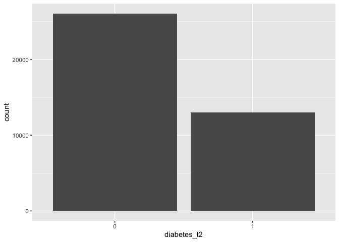
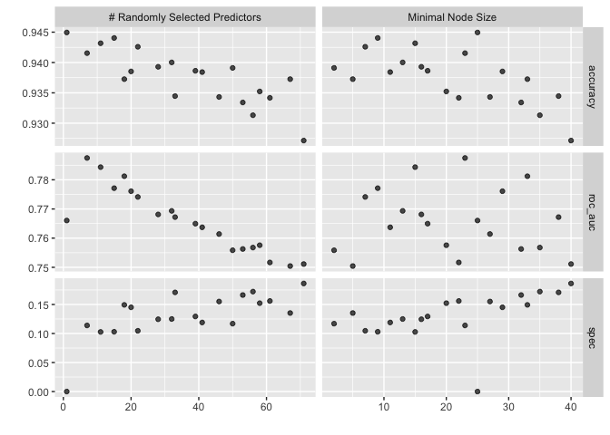
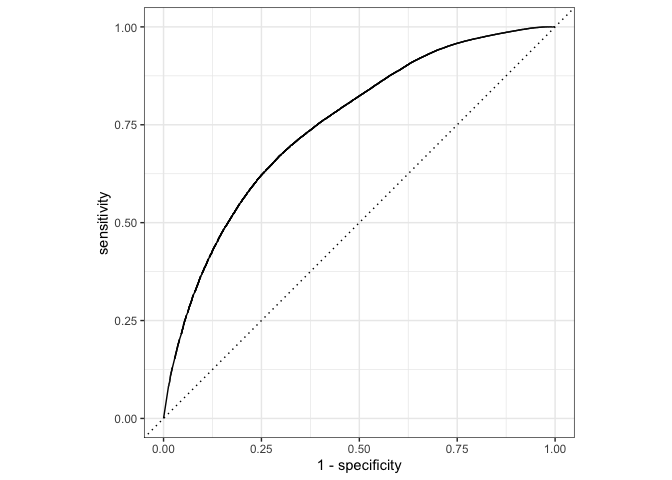
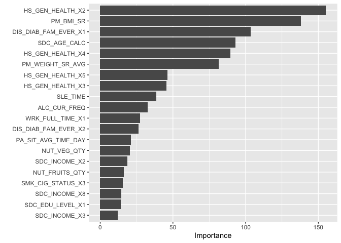
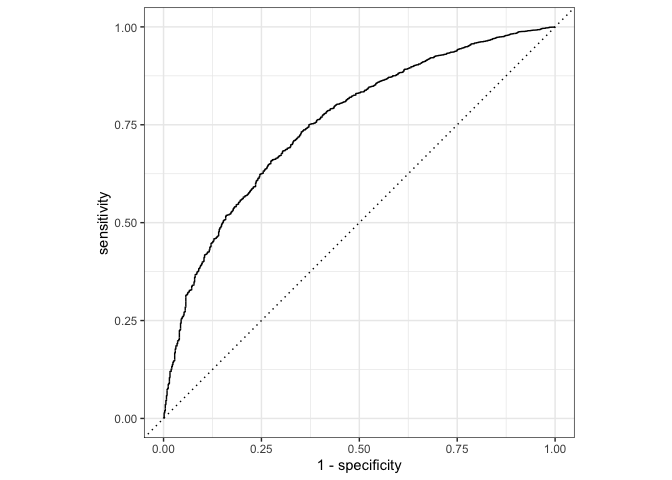

``` r
knitr::opts_chunk$set(echo = TRUE)
library(tidyverse)
library(tidymodels)
library(sjPlot)
library(finalfit)
library(knitr)
library(gtsummary)
library(mlbench)
library(rms)
library(vip)
library(rsample)
library(tune)
library(recipes)
library(yardstick)
library(parsnip)
library(glmnet)
library(themis)
library(microbenchmark)
library(ranger)
library(doParallel)
library(party)
library(partykit)
library(rpart)
library(rpart.plot)
```

# 1. Random Forest

Here we are going to expand on our logistic regression analysis and conduct a similar approach with Random Forest models. If you missed the Logistic Regression approach [start here first](https://github.com/walkabilly/machine_learning_for_epi/blob/main/logistic_regression_ml.Rmd). 

> Random forests or random decision forests is an ensemble learning method for classification, regression and other tasks that operates by constructing a multitude of decision trees at training time. For classification tasks, the output of the random forest is the class selected by most trees. For regression tasks, the mean or average prediction of the individual trees is returned. [wiki](https://en.wikipedia.org/wiki/Random_forest)

## 2. Research question and data

We are using an imputed (ie. no missing data) version of the CanPath student dataset [https://canpath.ca/student-dataset/](https://canpath.ca/student-dataset/). The nice thing about this dataset is that it's pretty big in terms of sample size, has lots of variables, and we can use it for free. 

Our research question is:  

- **Can we develop a model that will predict type 2 diabetes**

We have identified that the following factors are associated with type 2 diabetes:   

- `PM_BMI_SR` = Are overweight
- `SDC_AGE_CALC` = Are 45 years or older
- `No varaible in data` = Have a parent, brother, or sister with type 2 diabetes
- `PA_LEVEL_LONG` = Are physically active less than 3 times a week
- `diabetes == "Gestational"` = Have ever had gestational diabetes (diabetes during pregnancy) or given birth to a baby who weighed over 9 pounds
- `SDC_EB_ABORIGINAL` + `SDC_EB_LATIN` + `SDC_EB_BLACK` = Are an African American, Hispanic or Latino, American Indian, or Alaska Native person
- `DIS_LIVER_FATTY_EVER` = Have non-alcoholic fatty liver disease

### Reading in data

Here are reading in data and getting organized to run our models. 


``` r
data <- read_csv("data_imputed.csv")
```

```
## Rows: 39392 Columns: 29
## ── Column specification ────────────────────────────────────────────────────────
## Delimiter: ","
## chr  (6): diabetes, pa_cat, latinx, indigenous, eb_black, fatty_liver
## dbl (23): diabetes_t2, PM_BMI_SR, SDC_AGE_CALC, SDC_MARITAL_STATUS, SDC_EDU_...
## 
## ℹ Use `spec()` to retrieve the full column specification for this data.
## ℹ Specify the column types or set `show_col_types = FALSE` to quiet this message.
```

``` r
data$diabetes <- NULL

cols <- c("pa_cat", "latinx", "indigenous", "eb_black", "fatty_liver", "SDC_MARITAL_STATUS", "SDC_EDU_LEVEL", "SDC_INCOME", "HS_GEN_HEALTH",  "SDC_BIRTH_COUNTRY", "SMK_CIG_STATUS", "DIS_DIAB_FAM_EVER", "DIS_DIAB_FAM_EVER", "HS_ROUTINE_VISIT_EVER", "DIS_STROKE_EVER", "DIS_COPD_EVER", "DIS_LC_EVER", "DIS_IBS_EVER", "DIS_DIAB_FAM_EVER", "WRK_FULL_TIME", "WRK_STUDENT", "PM_BMI_SR", "PM_WEIGHT_SR_AVG")
data %<>% mutate_at(cols, factor)

data$diabetes_t2 <- as.factor(data$diabetes_t2)
data$PM_BMI_SR <- as.numeric(data$PM_BMI_SR)
data$PM_WEIGHT_SR_AVG <- as.numeric(data$PM_WEIGHT_SR_AVG)
```


``` r
# Fix the random numbers by setting the seed 
# This enables the analysis to be reproducible when random numbers are used 
set.seed(10)

data_split <- initial_split(data, prop = 0.70, strata = diabetes_t2)

# Create data frames for the two sets:
train_data <- training(data_split)
table(train_data$diabetes_t2)
```

```
## 
##     0     1 
## 26057  1517
```

``` r
test_data  <- testing(data_split)
table(test_data$diabetes_t2)
```

```
## 
##     0     1 
## 11150   668
```

## 3. Random Forest

We are going to use Random Forest models here. We already know from the logistic regression approach that we need to upsample the data to get better model performance. We are just going to run a Random Forest model without much intervention. We are using the `ranger` package here but there are other packages for random forest models available in R. First, let's setup the Random Forest models. In general, there are 3 key hyperparameters we need to examine

1. `mtry` (the number of predictors to sample at each split)
2. `min_n` (the number of observations needed to keep splitting nodes)
3. `tress` (number of trees in the model)

Here we are setting up the recipe and the workflow for the model. Here we have some general information about the model. We setup with 1000 trees in the model, 27 independent variables. As we have previous discussed we will need to tune the model to get the best combination of predictors for each split (`mtry`) and the number of observations to split (`min_n`).

Here we are using the engine `ranger` and with the mode is classification because we are interested in a binary outcome. If this were a linear regression we set the mode to `regression`. 

#### Model


``` r
cores <- parallel::detectCores()  ## Here we will need to setup cores to make this run more efficiently. My laptop has 8 cores.
cores
```

```
## [1] 8
```

``` r
rf_model <- rand_forest(mtry = tune(), 
                        min_n = tune(), 
                        trees = 100) %>% 
  set_engine("ranger", num.threads = cores) %>% 
  set_mode("classification")

rf_model
```

```
## Random Forest Model Specification (classification)
## 
## Main Arguments:
##   mtry = tune()
##   trees = 100
##   min_n = tune()
## 
## Engine-Specific Arguments:
##   num.threads = cores
## 
## Computational engine: ranger
```

#### Recipe 

The code below is the recipe for the oversample data that we already ran previously in the logistic regression part. 


``` r
diabetes_rec_oversamp_rf <- recipe(diabetes_t2 ~ ., data = train_data) %>%
  step_upsample(diabetes_t2, over_ratio = 0.5) %>%
  step_normalize(all_numeric_predictors()) %>%
  step_dummy(all_nominal_predictors())

recipe(~., train_data) %>%
  step_upsample(diabetes_t2, over_ratio = 0.5) %>%
  prep() %>%
  bake(new_data = NULL) %>%
  ggplot(aes(diabetes_t2)) +
  geom_bar()
```

<!-- -->

#### Workflow 


``` r
diabetes_wflow_oversamp_rf <- workflow() %>% 
  add_model(rf_model) %>% 
  add_recipe(diabetes_rec_oversamp_rf) 
```

#### Tuning

Here were are setup which parts of the model that we are tuning. 


``` r
extract_parameter_set_dials(rf_model)
```

```
## Collection of 2 parameters for tuning
## 
##  identifier  type    object
##        mtry  mtry nparam[?]
##       min_n min_n nparam[+]
## 
## Model parameters needing finalization:
##    # Randomly Selected Predictors ('mtry')
## 
## See `?dials::finalize` or `?dials::update.parameters` for more information.
```

Here the output tells use that we are tuning the `mtry` and the `min_n` parameters for the model. 

#### Training and tuning

Setup the number of folds and the tuning for the 


``` r
diabetes_folds <- vfold_cv(train_data, v = 5)

rf_result <- 
  diabetes_wflow_oversamp_rf %>% 
  tune_grid(diabetes_folds,
            grid = 20,
            control = control_grid(save_pred = TRUE, 
                                   verbose = FALSE),  # Edit this for running live
            metrics = metric_set(roc_auc, accuracy, spec)
            )
```

```
## i Creating pre-processing data to finalize unknown parameter: mtry
```

``` r
autoplot(rf_result) 
```

<!-- -->

``` r
predictions <- rf_result %>% 
                  collect_predictions()
predictions
```

```
## # A tibble: 551,480 × 9
##    .pred_class .pred_0 .pred_1 id     .row  mtry min_n diabetes_t2 .config      
##    <fct>         <dbl>   <dbl> <chr> <int> <int> <int> <fct>       <chr>        
##  1 0             0.666   0.334 Fold1     1     1    25 0           Preprocessor…
##  2 0             0.704   0.296 Fold1     3     1    25 0           Preprocessor…
##  3 0             0.662   0.338 Fold1     6     1    25 0           Preprocessor…
##  4 0             0.704   0.296 Fold1     9     1    25 0           Preprocessor…
##  5 0             0.712   0.288 Fold1    11     1    25 0           Preprocessor…
##  6 0             0.750   0.250 Fold1    15     1    25 0           Preprocessor…
##  7 0             0.645   0.355 Fold1    26     1    25 0           Preprocessor…
##  8 0             0.695   0.305 Fold1    28     1    25 0           Preprocessor…
##  9 0             0.700   0.300 Fold1    31     1    25 0           Preprocessor…
## 10 0             0.683   0.317 Fold1    32     1    25 0           Preprocessor…
## # ℹ 551,470 more rows
```

``` r
rf_best <- 
  rf_result %>% 
  select_best(metric = "accuracy")

rf_best
```

```
## # A tibble: 1 × 3
##    mtry min_n .config              
##   <int> <int> <chr>                
## 1     1    25 Preprocessor1_Model01
```

#### Creating the ROC curve for the models 


``` r
roc_curve_rf <- predictions %>%
  roc_curve(truth = diabetes_t2, .pred_0) %>%
  autoplot()

plot(roc_curve_rf)
```

<!-- -->

### Final model

We’ll start by building our parsnip model object again from scratch. We take our best hyperparameter values from our random forest model. When we set the engine, we add a new argument: `importance = "impurity"`. This will provide variable importance scores for this last model, which gives some insight into which predictors drive model performance.


``` r
# the last model
last_rf_mod <- 
  rand_forest(mtry = 1, 
              min_n = 25, 
              trees = 100) %>% 
  set_engine("ranger", num.threads = cores, importance = "impurity") %>% 
  set_mode("classification")

# the last workflow
last_rf_workflow <- 
  diabetes_wflow_oversamp_rf %>% 
  update_model(last_rf_mod)

# the last fit

last_rf_fit <- 
  last_rf_workflow %>% 
  last_fit(data_split)

last_rf_fit
```

```
## # Resampling results
## # Manual resampling 
## # A tibble: 1 × 6
##   splits                id             .metrics .notes   .predictions .workflow 
##   <list>                <chr>          <list>   <list>   <list>       <list>    
## 1 <split [27574/11818]> train/test sp… <tibble> <tibble> <tibble>     <workflow>
```

#### Show final model results


``` r
last_rf_fit %>% 
  collect_metrics()
```

```
## # A tibble: 3 × 4
##   .metric     .estimator .estimate .config             
##   <chr>       <chr>          <dbl> <chr>               
## 1 accuracy    binary         0.943 Preprocessor1_Model1
## 2 roc_auc     binary         0.754 Preprocessor1_Model1
## 3 brier_class binary         0.117 Preprocessor1_Model1
```

#### Feature importance


``` r
last_rf_fit %>% 
  extract_fit_parsnip() %>% 
  vip(num_features = 20)
```

<!-- -->


``` r
last_rf_fit %>% 
  collect_predictions() %>% 
  roc_curve(diabetes_t2, .pred_0) %>% 
  autoplot()
```

<!-- -->

# References

1. Decision Trees. [https://bradleyboehmke.github.io/HOML/DT.html](https://bradleyboehmke.github.io/HOML/DT.html)
2. A second model: tree-based ensemble. [https://www.tidymodels.org/start/case-study/#second-model](https://www.tidymodels.org/start/case-study/#second-model)
3. Tuning random forest hyperparameters with #TidyTuesday trees data. [https://juliasilge.com/blog/sf-trees-random-tuning/](https://juliasilge.com/blog/sf-trees-random-tuning/)
4. Introducing random forests in R. [https://jmsallan.netlify.app/blog/introducing-random-forests-in-r](https://jmsallan.netlify.app/blog/introducing-random-forests-in-r)
5. Chapter 11 Random Forests. [https://bradleyboehmke.github.io/HOML/random-forest.html](https://bradleyboehmke.github.io/HOML/random-forest.html)
